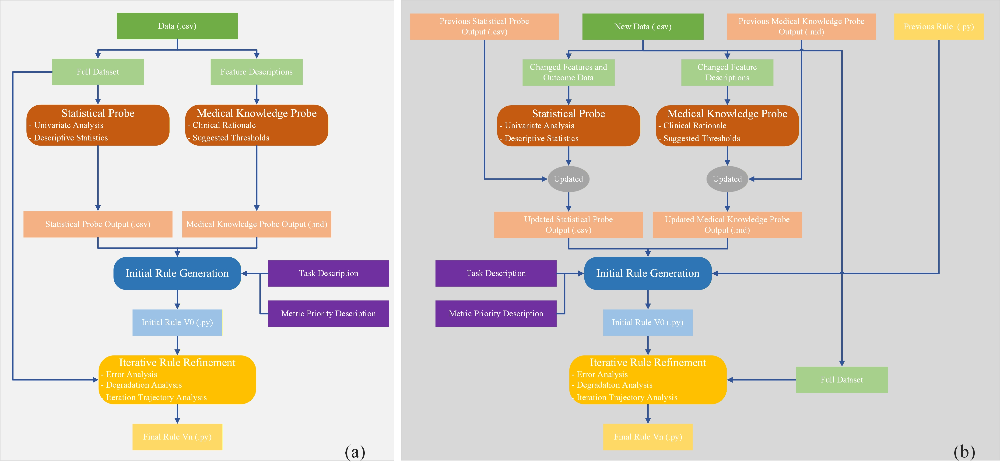

# Medical Heuristic Learning

参考引用：[Learning Beyond Gradients](https://trinkle23897.github.io/learning-beyond-gradients/)

[English README](./README.md)

## 摘要

面向临床表格数据的预测建模是临床决策支持的核心，因此不仅需要强预测性能，也需要透明的决策逻辑。尽管深度学习和基于树的集成方法可以取得较高准确率，但它们的黑盒性质仍然是临床部署的主要障碍。医学数据的一些常见特征进一步加剧了这一挑战，包括有限的样本量、严重的类别不平衡，以及由诊断标准和临床记录变化所引起的特征演化。为了解决这些问题，我们提出了 Medical Heuristic Learning（MHL），这是 learning-beyond-gradients 范式在临床表格预测中的一种实例化。MHL 不依赖神经网络权重更新，而是使用由大语言模型（LLM）驱动的工作流，将统计探针、医学知识探针、规则合成和代码级迭代优化整合起来，以优化一个确定且可执行的决策系统。最终得到的模型不是不透明的参数，而是版本化的纯 Python 决策规则，这些规则具有显式可解释性、完全可审计性和临床依据。MHL 还支持持续学习，即从先前已经验证的规则出发，在数据漂移或特征演化下，利用更新后的特征信息对这些规则进行迭代修订。对医学数据集的综合实验表明，MHL 在保持小样本和高度不平衡场景下良好表现的同时，取得了与 state-of-the-art 方法可比的性能。结果还进一步表明，这种显式规则更新机制有助于缓解特征演化下的灾难性遗忘。总体来看，这些发现表明，非梯度启发式系统为高风险临床决策支持提供了一种透明且可适应的替代方案。



## 仓库内容

Medical Heuristic Learning（MHL）是一个面向临床表格预测的轻量级框架，其核心产物不是训练得到的参数权重，而是可执行的规则代码。`hl/` 主干当前实现了：

- 基于训练集的单变量统计探针；
- 可选的 LLM 医学知识探针；
- 由 LLM 合成的初始规则函数 `predict_v0(features: dict) -> int`；
- 基于训练错误样本与退化样本提示的代码级迭代优化；
- 最终导出稳定入口 `predict(features: dict) -> int`。

此外，仓库还提供了面向特征漂移的持续学习流程。它不是完全从零重建规则，而是从上一轮 HL 输出目录出发，在删除、新增或重命名特征的条件下继承已有规则逻辑并继续适配。

## 实验发现

基于在多个医学数据集（包括 UK Biobank (UKB)、重症监护信息数据库 (CCID) 和 MIMIC）上的综合评估，并与具有代表性的基线模型（Logistic Regression、决策树、XGBoost、LightGBM、MLP、FT-Transformer）进行对比，MHL 展现出以下核心优势：

- **小样本场景下的鲁棒性**：在低资源条件（如 $n < 100$）下，MHL 始终优于黑盒基线模型。当标注数据稀缺时，医学先验知识和显式规则结构弥补了纯统计学习器的脆弱性。
- **应对极端类别不平衡的恢复力**：在高度倾斜的分布（如 50:1 或 1:50）下，许多黑盒模型会退化为近乎单边的预测。而在显式错误分析和退化警告的引导下，MHL 能够在少数类检测和多数类控制之间保持可用的平衡。
- **避免灾难性遗忘的持续学习**：当特征空间发生演化（例如，在败血症评估中从 SIRS 标准过渡到 SOFA 标准）时，传统模型会遭受严重的性能下降。MHL 通过显式识别废弃特征并通过代码级规则修订引入新信号来进行适配，从而避免了因覆盖隐藏参数而导致的灾难性遗忘。
- **探针的互补性**：消融实验证实，结合统计探针（提供经验信号）和医学知识探针（提供临床先验和阈值），可以获得最稳定、最不容易失效的性能。
- **LLM 后端的跨平台能力**：MHL 在不同的基座模型（如 DeepSeek、Gemini、GPT、Qwen）上均保持高效。结构化的工作流限制了幻觉的产生，并确保了生成的规则无论使用何种具体后端都是确定且可用的。

## 核心工作流

### 标准启发式学习

`hl.orchestrator.run_heuristic_learning(...)` 固定执行四个阶段：

1. 对 `train_df` 运行单变量统计探针。
2. 在启用 LLM 时运行知识探针。
3. 生成 `predict_v0` 并写入 `heuristic_system.py`。
4. 迭代追加 `predict_v1`、`predict_v2` 等版本，并将最佳版本导出为 `final_heuristic_model.py`。

主流程会先校验：

- `label_col` 是否同时存在于 `train_df` 和 `test_df`；
- 去除标签列后，训练集与测试集的特征集合是否一致。

### 特征漂移下的持续学习

`hl.continuous_learning.run_continuous_learning(...)` 仍然采用四阶段结构，但语义是漂移感知的：

1. 读取 `DriftConfig.prev_hl_out_dir` 指定的上一轮 HL 输出目录。
2. 在新的特征空间下更新单变量探针结果。
3. 尽可能保留并更新已有知识探针结果。
4. 基于旧的最终模型蓝本生成新的漂移感知 `predict_v0`，再继续执行迭代优化。

持续学习还会额外把漂移上下文和上一轮 probe 快照写入输出目录。

## 仓库结构

- `hl/config.py`
  标准流程配置数据类：`LLMConfig` 与 `RunConfig`。
- `hl/orchestrator/`
  标准启发式学习入口与四个阶段实现。
- `hl/continuous_learning/`
  漂移配置、持续学习入口与各阶段实现。
- `hl/probes/`
  统计探针与知识探针实现。
- `hl/agent/`
  OpenAI 兼容 LLM client，以及标准流程和持续学习专用 prompt 模板。
- `hl/evolution/`
  错误样本采样、退化检测、规则解析与语法校验工具。
- `hl/metrics.py`
  指标计算与指标优先级描述生成。
- `hl/utils/`
  文本/JSON 写入与终端进度打印工具。
- `example_training.py`
  基于 `./data/YHD_bicarbonate.csv` 的端到端训练示例，输出到 `./example_out`。
- `example_inference.py`
  加载 `./example_out/final_heuristic_model.py` 的推理示例。
- `example_continuous_learning.py`
  删除 `wbc` 特征以模拟漂移，并输出到 `./example_out_continuous_learning`。
- `experiment/`
  与可复用 `hl/` 主干分离的实验目录。

## 产物契约

生成出来的规则文件不是任意格式，后续脚本依赖明确约定。

### `heuristic_system.py`

- 首次生成时以 `CURRENT_VERSION = 'v0'` 开头；
- 包含 `predict_v0`、`predict_v1`、`predict_v2` 这类版本化规则函数；
- 可包含各版本对应的 `ERROR_ANALYSIS_predict_vX` 字符串；
- 迭代优化时通过追加新版本保留历史，而不是覆盖重写。

### `final_heuristic_model.py`

- 包含 `FINAL_VERSION = "vX"`；
- 内嵌累计的规则代码；
- 暴露稳定的 `predict(features: dict) -> int` 入口，并转发到最终选中的 `predict_vX`。

## 安装

环境要求：

- Python `>=3.11`
- 推荐包管理器：`uv`

安装基础依赖：

```bash
uv sync
```

安装示例和实验常用的完整依赖：

```bash
uv sync --group dev
```

`pyproject.toml` 中当前的依赖分组为：

- 运行时：`numpy`、`openai`、`pandas`、`scipy`
- 开发组：`scikit-learn`、`lightgbm`、`torch`、`xgboost`

实际运行提示：当前 `hl/metrics.py` 会直接导入 `scikit-learn` 计算指标，因此按照现有代码，若要运行完整训练或持续学习流程，应安装 `dev` 依赖组。

## 快速开始

先设置 API Key：

```bash
export DEEPSEEK_API_KEY="your-api-key"
```

运行标准训练示例：

```bash
uv run python example_training.py
```

运行推理示例：

```bash
uv run python example_inference.py
```

运行持续学习示例：

```bash
uv run python example_continuous_learning.py
```

### 根目录示例脚本实际行为

- `example_training.py`
  读取 `./data/YHD_bicarbonate.csv`，标签列为 `hospital_expire_flag`，使用 `0:500` 行作为训练集、`500:1000` 行作为测试集，输出到 `./example_out`。
- `example_inference.py`
  从 `./example_out/final_heuristic_model.py` 加载模型，并对 `./data/YHD_bicarbonate.csv` 的最后 5 行做推理。
- `example_continuous_learning.py`
  复用 `./example_out` 作为上一阶段产物，删除 `wbc` 特征模拟新环境漂移，并写入 `./example_out_continuous_learning`。

## 最小调用示例

### 标准流程

```python
from hl.config import LLMConfig, RunConfig
from hl.orchestrator import run_heuristic_learning

run_cfg = RunConfig()
llm_cfg = LLMConfig(
    api_key="your-api-key",  # 可选；不传时从 api_key_env 读取
)

run_heuristic_learning(
    train_df=train_df,
    test_df=test_df,
    label_col="hospital_expire_flag",
    run_cfg=run_cfg,
    llm_cfg=llm_cfg,
)
```

### 持续学习流程

```python
from pathlib import Path

from hl.config import LLMConfig
from hl.continuous_learning import ContinuousLearningConfig, DriftConfig, run_continuous_learning

llm_cfg = LLMConfig(api_key="your-api-key")
continuous_cfg = ContinuousLearningConfig(
    drift=DriftConfig(
        dropped_cols=("old_feature",),
        added_cols=("new_feature",),
        renamed_cols=(("old_name", "new_name"),),
        change_note="在这里描述特征漂移。",
        prev_hl_out_dir=Path("./example_out"),
    )
)

result = run_continuous_learning(
    train_df=train_df,
    test_df=test_df,
    label_col="hospital_expire_flag",
    llm_cfg=llm_cfg,
    continuous_cfg=continuous_cfg,
)

print(result.out_dir)
print(result.final_model_path)
```

## 输出目录与文件

当 `RunConfig.output_dir is None` 时，标准流程输出到：

- `./out/<时间戳>/`

当 `ContinuousLearningConfig.output_dir is None` 时，持续学习流程输出到：

- `./out/<时间戳>_continuous_learning/`

标准 HL 典型产物包括：

- `probe_univariate_results.csv`
- `probe_knowledge.md`
- `heuristic_system.py`
- `evolution_results.txt`
- `iteration_log.json`
- `final_heuristic_model.py`
- `final_comparison.txt`

持续学习会额外产出：

- `continuous_learning_context.json`
- `probe_univariate_results_prev.csv`
- `probe_knowledge_prev.md`

## 运行时行为

`hl/` 主干在运行时会向标准输出打印阶段进度，典型信息包括：

- 整体运行开始与结束；
- 输出目录解析结果；
- 单变量探针、知识探针、`v0` 生成、迭代优化的阶段边界；
- LLM 重试失败原因、被接受的新版本以及检测到的回归样本。

这些输出由 `hl/utils/progress.py` 实现，默认启用。

## Prompt 与规则约束

当前 `hl/agent/prompts.py` 与 `hl/agent/continuous_prompts.py` 中的 prompt 约束包括：

- LLM 输出正文必须使用英文；
- `v0` 生成与迭代更新都要求返回严格 JSON；
- 规则必须是自包含的纯 Python；
- 规则只能使用 Python 标准库，不能依赖第三方包；
- 每个 `if` / `elif` / `else` 分支都必须带英文注释，说明医学依据或设计意图；
- 迭代更新强调小步修改，而不是整份函数重写。

代码侧会在接受提案前校验 JSON 结构、Python 语法以及函数名是否符合约定。

## API 概览

### `LLMConfig`

用于配置 OpenAI 兼容后端。

| 字段 | 类型 | 默认值 | 说明 |
| --- | --- | --- | --- |
| `base_url` | `str` | `"https://api.deepseek.com/v1"` | API 基础地址。 |
| `api_key` | `str \| None` | `None` | 直接传入的 API Key；若提供则优先使用。 |
| `api_key_env` | `str` | `"DEEPSEEK_API_KEY"` | 未显式传入 `api_key` 时读取的环境变量名。 |
| `model_name` | `str` | `"deepseek-v4-pro"` | 传给 OpenAI 兼容 client 的模型名。 |
| `temperature` | `float` | `0.3` | 采样温度。 |
| `extra_body` | `dict \| None` | `None` | 后端特定能力需要的额外请求体。 |

Key 解析逻辑：

- 若传入 `api_key`，直接使用；
- 否则读取 `api_key_env` 指定的环境变量；
- 若启用了 LLM 且两者都不可用，则初始化 client 时抛错。

### `RunConfig`

用于配置标准启发式学习流程。

| 字段 | 类型 | 默认值 | 说明 |
| --- | --- | --- | --- |
| `output_dir` | `Path \| None` | `None` | 为 `None` 时输出到 `./out/<时间戳>/`。 |
| `iterations` | `int` | `10` | 最大迭代轮数。 |
| `metric_priority` | `tuple[str, ...]` | `("F1", "ACC", "Sensitivity", "Specificity")` | 最终版本选择与 prompt 指导所使用的指标优先级。 |
| `train_baselines` | `bool` | `False` | 预留字段；主编排器当前未使用。 |
| `run_univariate_probe` | `bool` | `True` | 是否计算单变量探针。 |
| `run_knowledge_probe` | `bool` | `True` | 是否调用 LLM 知识探针。 |
| `run_v0_generation` | `bool` | `True` | 若规则文件不存在，是否生成 `predict_v0`。 |
| `run_iterations` | `bool` | `True` | 是否执行规则迭代优化。 |
| `max_error_samples` | `int` | `100` | 每轮最多采样的训练错误样本数。 |
| `max_error_details` | `int` | `40` | prompt 中最多展开的详细错误样本数。 |
| `degradation_threshold` | `int` | `10` | 预留字段；当前未直接生效。 |
| `degradation_rate` | `float` | `0.05` | 预留字段；当前未直接生效。 |
| `degradation_max_examples` | `int` | `30` | 进入下一轮上下文的退化样本上限。 |
| `max_llm_attempts` | `int` | `4` | 解析或校验失败时的最大重试次数。 |
| `task_description` | `str` | `""` | 注入 prompt 的任务描述。 |
| `enable_auto_patch` | `bool` | `False` | 面向未来 patch 流程的预留字段。 |
| `max_specificity_drop` | `float` | `1.0` | 预留字段。 |
| `max_acc_drop` | `float` | `1.0` | 预留字段。 |
| `univariate_top_k` | `int` | `30` | 进入 prompt 的单变量摘要 top-k 条数。 |
| `knowledge_top_k` | `int` | `20` | 预留字段；当前未直接生效。 |
| `random_seed` | `int` | `42` | 错误样本与退化样本采样种子。 |
| `llm_enabled` | `bool` | `True` | 是否初始化 LLM client 并执行依赖 LLM 的步骤。 |

### `run_heuristic_learning`

```python
def run_heuristic_learning(
    train_df: pd.DataFrame,
    test_df: pd.DataFrame,
    label_col: str,
    run_cfg: RunConfig,
    llm_cfg: LLMConfig,
) -> None:
```

行为概述：

- 校验标签列与特征集合一致性；
- 解析输出目录；
- 顺序执行单变量探针、知识探针、`v0` 生成与迭代优化；
- 写出各类中间文件与日志；
- 按 `metric_priority` 选择最佳版本并导出 `final_heuristic_model.py`。

### `DriftConfig`

用于描述特征或 schema 漂移。

| 字段 | 类型 | 默认值 | 说明 |
| --- | --- | --- | --- |
| `dropped_cols` | `tuple[str, ...]` | `()` | 新环境中删除的特征。 |
| `added_cols` | `tuple[str, ...]` | `()` | 新增或恢复的特征。 |
| `renamed_cols` | `tuple[tuple[str, str], ...]` | `()` | 特征重命名映射 `(old_name, new_name)`。 |
| `change_note` | `str` | `""` | 对漂移的自然语言说明。 |
| `prev_hl_out_dir` | `Path \| None` | `None` | 用于适配的上一轮 HL 输出目录。 |

### `ContinuousLearningConfig`

用于配置漂移感知的持续学习流程。

| 字段 | 类型 | 默认值 | 说明 |
| --- | --- | --- | --- |
| `drift` | `DriftConfig` | `DriftConfig()` | 漂移配置。 |
| `output_dir` | `Path \| None` | `None` | 为 `None` 时输出到 `./out/<时间戳>_continuous_learning/`。 |
| `iterations` | `int` | `10` | 最大迭代轮数。 |
| `metric_priority` | `tuple[str, ...]` | `("F1", "ACC", "Sensitivity", "Specificity")` | 最终版本选择与 prompt 指导所用指标优先级。 |
| `run_univariate_probe` | `bool` | `True` | 是否更新单变量探针。 |
| `run_knowledge_probe` | `bool` | `True` | 是否更新知识探针。 |
| `run_v0_generation` | `bool` | `True` | 是否生成新的漂移感知 `predict_v0`。 |
| `run_iterations` | `bool` | `True` | 是否继续执行适配迭代。 |
| `max_error_samples` | `int` | `100` | 每轮最多采样的训练错误样本数。 |
| `max_error_details` | `int` | `40` | prompt 中最多展开的详细错误样本数。 |
| `degradation_max_examples` | `int` | `30` | 保留到 prompt 中的退化样本上限。 |
| `max_llm_attempts` | `int` | `4` | LLM 输出校验失败时的最大重试次数。 |
| `task_description` | `str` | `""` | 注入 prompt 的任务描述。 |
| `univariate_top_k` | `int` | `30` | 更新后单变量摘要进入上下文的 top-k 条数。 |
| `random_seed` | `int` | `42` | 适配流程采样种子。 |
| `llm_enabled` | `bool` | `True` | 是否初始化 LLM client。 |

### `ContinuousLearningResult`

`run_continuous_learning(...)` 的返回对象。

| 字段 | 类型 | 说明 |
| --- | --- | --- |
| `out_dir` | `Path` | 本次持续学习运行的输出目录。 |
| `heuristic_path` | `Path` | 适配后的 `heuristic_system.py` 路径。 |
| `final_model_path` | `Path` | 导出的最终模型路径。 |

### `run_continuous_learning`

```python
def run_continuous_learning(
    *,
    train_df: pd.DataFrame,
    test_df: pd.DataFrame,
    label_col: str,
    llm_cfg: LLMConfig,
    continuous_cfg: ContinuousLearningConfig,
) -> ContinuousLearningResult:
```

行为概述：

- 校验新环境下的标签列与特征集合；
- 写出 `continuous_learning_context.json`；
- 在漂移条件下更新单变量探针与知识探针；
- 以旧的最终模型为蓝本生成新的漂移感知 `predict_v0`；
- 复用同样的迭代优化模式并返回关键路径。

## Probe 行为

### 单变量探针

`hl/probes/univariate.py` 当前实现会：

- 将非二值数值特征视为连续变量；
- 对连续变量同时计算 point-biserial correlation 与 Mann-Whitney U，并保留更优的 p 值；
- 对二值/类别特征在适用时计算卡方统计量；
- 记录缺失率、统计摘要以及类别频数；
- 最终按 `p_value` 再按 `missing_rate` 排序。

### 知识探针

`hl/probes/knowledge.py` 要求 LLM 返回固定列结构的 Markdown 表：

| Feature | Univariate signal (summary) | Clinical rationale | Suggested threshold | Evidence confidence (high/medium/low) |
| --- | --- | --- | --- | --- |

## 实验目录

`experiment/` 与可复用的 `hl/` 主干分离。当前子目录包括：

- `experiment/ablation/`
  探针与流程消融实验。
- `experiment/contrast0/`
  不同 LLM 后端的对比实验。
- `experiment/contrast1/`
  以训练集规模为重点的对比实验。
- `experiment/contrast2/`
  以类别比例为重点的对比实验。
- `experiment/continuous_learning/`
  多阶段持续学习实验与 baseline 对比。

每个实验子目录都提供自己的 README，说明数据要求与运行命令。

## 说明

- 如果需要稳定可复现的输出路径，请显式传入 `output_dir`。
- 当 `llm_enabled=False` 时，依赖 LLM 的步骤只能复用磁盘上已有产物，不能凭空生成新规则。
- 当 `run_univariate_probe=False` 或 `run_knowledge_probe=False` 时，流程会优先尝试复用输出目录中的缓存文件。
- 持续学习会把上一轮 probe 快照保存在 `probe_univariate_results_prev.csv` 与 `probe_knowledge_prev.md` 中。
