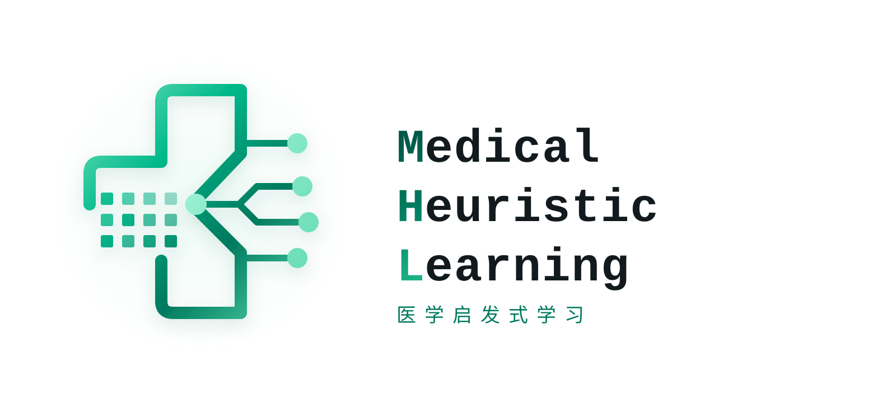
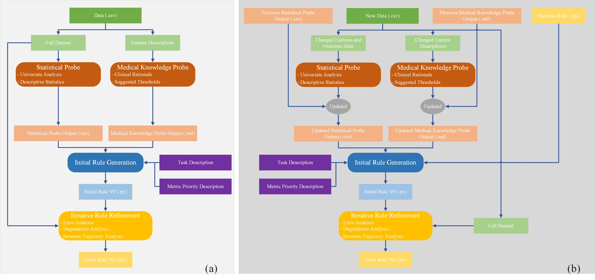

# Medical Heuristic Learning (MHL)

[](https://pypi.org/project/medical-heuristic-learning/)
[](https://pypi.org/project/medical-heuristic-learning/)
[](https://github.com/MPU-Li-OmicsLab/medical-heuristic-learning/actions/workflows/ci.yml)
[](https://docs.pytest.org/)
[](https://arxiv.org/abs/2606.16337)
[](./LICENSE)
[](https://liomicslab.cn/)

**Medical Heuristic Learning (MHL) is a predictive modeling paradigm for medical tabular data that employs a large language model as a white-box rule generator. It is particularly well suited to small-sample and severely class-imbalanced settings, as well as applications that require high levels of model interpretability and auditability.**

[简体中文](./README-CN.md) · English · [Paper](https://arxiv.org/abs/2606.16337) · [API Documentation](./docs/API.md)

## Overview

Medical Heuristic Learning (MHL) instantiates the [Learning Beyond Gradients](https://trinkle23897.github.io/learning-beyond-gradients/) paradigm for classification tasks involving structured medical data. In contrast to neural networks, which encode acquired knowledge in latent parameters, MHL transforms statistical evidence, medical prior knowledge, and validation feedback into versioned, executable, interpretable, and auditable decision rules written in pure Python.

**Basic suitability criteria:**

- The task involves classification using medical tabular data.
- At least one supported large language model, such as GPT, Claude, or DeepSeek, is accessible through an API.

**Settings in which MHL is particularly advantageous:**

- The application requires a transparent, interpretable, and auditable decision process.
- Only a limited number of labeled training samples are available.
- The data exhibit severe or extreme class imbalance.

**MHL provides the following core capabilities:**

- **White-box artifacts:** The final model is a deterministic `predict(features: dict) -> int` rule function rather than a set of opaque model parameters.
- **Dual-probe constraints:** The statistical probe supplies descriptive statistics and univariate associations, whereas the medical knowledge probe supplies clinical interpretations, candidate thresholds, and evidence-confidence assessments.
- **Controlled rule evolution:** The LLM generates the initial rule and subsequently performs incremental code revisions informed by misclassified cases, degradation cases, metric priorities, and the version trajectory.
- **Continual learning:** When features are added, removed, or renamed, the system inherits the probe and rule artifacts from the preceding stage and explicitly revises the existing logic in light of the updated evidence.
- **Test assurance:** The core workflow is covered by `pytest` and continuously validated through GitHub Actions.

For the complete methodology and experimental design, see [Medical Heuristic Learning: An LLM-Driven Framework for Interpretable and Auditable Clinical Decision Rules](https://arxiv.org/abs/2606.16337).

## Quick Start

### 1. Install with pip

Python 3.11 or later is required. Once the package is available on PyPI, install it with:

```bash
python -m pip install medical-heuristic-learning
```

Alternatively, install the package directly from GitHub or from a local clone:

```bash
python -m pip install "git+https://github.com/MPU-Li-OmicsLab/medical-heuristic-learning.git"

git clone https://github.com/MPU-Li-OmicsLab/medical-heuristic-learning.git
cd medical-heuristic-learning
python -m pip install -e .
```

The default LLM backend uses an OpenAI-compatible interface. To use the DeepSeek API, configure the `DEEPSEEK_API_KEY` environment variable:

```bash
export DEEPSEEK_API_KEY="your-api-key"
```

Other compatible models and their API credentials can be specified through the model configuration; see the [API documentation](./docs/API.md).

### 2. Run MHL

The following minimal example uses synthetic medical tabular data and can be saved directly as `minimal_example.py`. Both `train_df` and `val_df` must contain the label column, and their feature sets must be identical after the label column is removed.

```python
from pathlib import Path

import pandas as pd

from hl import LLMConfig, RunConfig, load_model, run_heuristic_learning

# Synthetic binary classification data for workflow demonstration only; not real clinical data.
data = pd.DataFrame(
    {
        "age": [35, 72, 44, 81, 53, 67, 29, 76, 48, 70, 39, 84],
        "heart_rate": [72, 118, 80, 126, 88, 110, 68, 121, 84, 115, 75, 130],
        "wbc": [6.1, 15.2, 7.4, 17.8, 9.0, 13.6, 5.8, 16.1, 8.2, 14.4, 6.9, 18.3],
        "hospital_expire_flag": [0, 1, 0, 1, 0, 1, 0, 1, 0, 1, 0, 1],
    }
)
train_df = data.iloc[:8].copy()
val_df = data.iloc[8:].copy()

result = run_heuristic_learning(
    train_df=train_df,
    val_df=val_df,
    label_col="hospital_expire_flag",
    run_cfg=RunConfig(
        output_dir=Path("./mhl_out"),
        iterations=1,
        task_description=(
            "Predict the risk of in-hospital mortality from the available "
            "clinical features."
        ),
    ),
    llm_cfg=LLMConfig(api_key_env="DEEPSEEK_API_KEY"),
)

print(result.final_model_path)

predict = load_model(result.final_model_path)
prediction = predict({"age": 74, "heart_rate": 119, "wbc": 15.0})
print(f"prediction={prediction}")
```

See [example_training.py](./example_training.py) for a complete executable example.

### 3. Reload a Model and Run Inference

Exported models support both single-row dictionary inputs and batched `DataFrame` inputs:

```python
from hl import load_batch_model, load_model

predict_one = load_model("./mhl_out/final_heuristic_model.py")
prediction = predict_one({"age": 68, "wbc": 13.2})

predict_batch = load_batch_model("./mhl_out/final_heuristic_model.py")
predictions = predict_batch(feature_dataframe)
```

Inputs must contain model features only. The caller is responsible for removing labels and performing any other preprocessing. Because model files contain executable Python code, only artifacts from trusted sources should be loaded. See [example_inference.py](./example_inference.py) for a complete example.

### 4. Continual Learning

Continual learning requires the output directory from the preceding stage and an explicit description of all added, removed, or renamed features:

```python
from pathlib import Path

from hl import (
    ContinuousLearningConfig,
    DriftConfig,
    LLMConfig,
    run_continuous_learning,
)

result = run_continuous_learning(
    train_df=new_train_df,
    val_df=new_val_df,
    label_col="hospital_expire_flag",
    llm_cfg=LLMConfig(api_key_env="DEEPSEEK_API_KEY"),
    continuous_cfg=ContinuousLearningConfig(
        output_dir=Path("./mhl_out_continual"),
        task_description=(
            "Adapt the existing clinical rule system to the updated feature schema "
            "while preserving in-hospital mortality prediction performance."
        ),
        drift=DriftConfig(
            dropped_cols=("wbc",),
            added_cols=("new_marker",),
            renamed_cols=(("old_name", "new_name"),),
            change_note=(
                "The wbc feature is no longer available, new_marker has been added, "
                "and old_name has been renamed to new_name."
            ),
            prev_hl_out_dir=Path("./mhl_out"),
        ),
    ),
)
```

See [example_continuous_learning.py](./example_continuous_learning.py) for a complete executable example.

### 5. Generated Artifacts

By default, the standard workflow writes to `./out/{timestamp}/`, whereas the continual-learning workflow writes to `./out/{timestamp}_continuous_learning/`.

| Artifact | Description |
| --- | --- |
| `probe_univariate_results.csv` | Statistical-probe results and feature rankings. |
| `probe_knowledge.md` | Structured medical knowledge table generated by the medical knowledge probe. |
| `heuristic_system.py` | All versioned rules, including `predict_v0`, `predict_v1`, and subsequent versions. |
| `evolution_results.txt` | Validation-metric trajectory across rule versions. |
| `iteration_log.json` | Per-iteration proposals, validation outcomes, acceptance states, and degradation cases. |
| **`final_heuristic_model.py`** | Principal final-rule artifact containing the selected rule version and the stable `predict(...)` entry point. |
| `final_comparison.txt` | Metric comparison among the initial, selected, and final generated versions. |

Continual learning additionally produces `continuous_learning_context.json`, `probe_univariate_results_prev.csv`, and `probe_knowledge_prev.md`, which record the drift context and snapshots of the preceding-stage probes.

## API Documentation

- [English API documentation](./docs/API.md): package-level public interfaces, configuration fields, return types, exceptions, and artifact contracts aligned with the current `src/hl` implementation.
- [中文 API 文档](./docs/API-CN.md).

## Workflow Design



The standard MHL workflow comprises four stages:

1. **Statistical probe:** Extracts descriptive statistics, missingness rates, and univariate associations from the training data, thereby providing a low-assumption empirical basis for rule generation.
2. **Medical knowledge probe:** Uses the LLM to derive clinical interpretations, candidate thresholds, and evidence-confidence assessments from the feature and task semantics.
3. **Initial rule generation:** Integrates evidence from both probes with the task description and metric priorities to generate `predict_v0`, which is then validated for output structure, Python syntax, and function naming.
4. **Rule iteration:** Executes the current rule, analyzes classification errors and version-level degradation, and instructs the LLM to make incremental revisions. A candidate enters the version history only after validation and evaluation; the best version is ultimately exported according to the configured metric priority.

**Continual learning** retains the same four-stage feedback loop but treats previously validated probe results and the final rule as explicit prior information. Following a change in feature space, the system removes obsolete features, resolves renamed features, augments the evidence for newly introduced features, and generates a drift-aware new `v0` before resuming iterative refinement. Adaptation is therefore represented as an explicit and auditable sequence of code revisions rather than as an opaque overwrite of latent parameters.

## Experimental Findings

The experiments examine training-set size, class ratio, probe ablation, LLM backend choice, and feature evolution. Each experiment directory addresses a distinct research question:

| Experiment directory | Study | Principal comparison |
| --- | --- | --- |
| [`experiment/contrast0/`](./experiment/contrast0/README.md) | LLM backend comparison | Compares the white-box rules generated by different LLMs and reasoning-effort settings under identical data partitions and MHL workflows. |
| [`experiment/contrast1/`](./experiment/contrast1/README.md) | Training-set-size study | Varies the number of balanced training samples and compares the small-sample performance of MHL with machine-learning, deep-learning, and interpretable-model baselines. |
| [`experiment/contrast2/`](./experiment/contrast2/README.md) | Class-imbalance study | Holds the total training-set size fixed while varying the positive-to-negative class ratio, thereby evaluating sensitivity and specificity under extreme imbalance. |
| [`experiment/ablation/`](./experiment/ablation/README.md) | Probe ablation study | Selectively enables or disables the statistical and medical knowledge probes to quantify their contributions to rule generation and refinement. |
| [`experiment/continuous_learning/`](./experiment/continuous_learning/README.md) | Continual-learning study | Compares state inheritance with training from scratch when SIRS is removed, SOFA is introduced, and only limited second-stage data are available. |

The shared baselines, preprocessing procedures, and evaluation utilities are implemented in `experiment/modeling/`; experiment artifacts are retained in `experiment/outputs_rerun/`. Neither directory constitutes an independent experiment.

The principal findings are as follows:

- **Overall predictive performance:** Across multiple medical tabular datasets, MHL achieves predictive performance comparable to that of strong representative baselines while preserving complete and executable decision logic.
- **Small-sample robustness:** When labeled data are scarce, medical prior knowledge and explicit rule structure reduce dependence on large-sample parameter estimation, allowing MHL to remain competitive.
- **Adaptation to class imbalance:** Under extreme class ratios, conventional models can degenerate toward near-single-class predictions. MHL uses metric priorities, explicit error analysis, and degradation feedback to adjust the trade-off between sensitivity and specificity.
- **Probe complementarity:** Statistical evidence constrains empirical relevance, whereas medical knowledge constrains clinical plausibility. Ablation results support their combined use for more stable rule generation and refinement.
- **Continual-learning capability:** Under feature evolution and limited new-stage data, inheriting and revising prior rules helps preserve validated knowledge and mitigates the forgetting associated with training from scratch or overwriting latent parameters.
- **Portability across LLM backends:** Multiple LLM backends can be integrated into the same constrained workflow. The deployed artifact remains a deterministic pure-Python rule system rather than the LLM itself.

See the [arXiv paper](https://arxiv.org/abs/2606.16337) for the complete experimental results.

## Repository Structure

```text
medical-heuristic-learning/
├── src/hl/
│   ├── agent/                  # OpenAI-compatible client and prompt templates
│   ├── continuous_learning/    # Continual learning under feature evolution
│   ├── evolution/              # Error analysis, degradation detection, and rule validation
│   ├── orchestrator/           # Standard four-stage MHL orchestration
│   ├── probes/                 # Statistical and medical knowledge probes
│   ├── config.py               # LLMConfig and RunConfig
│   ├── metrics.py              # Classification metrics
│   ├── model.py                # Single-row and batch model loading
│   └── result.py               # Run artifact-path types
├── docs/                       # API documentation
├── tests/                      # pytest test suite
├── experiment/                 # Comparative, ablation, and continual-learning experiments
├── supporting_files/           # README title image and workflow figure
├── example_training.py         # Training example
├── example_inference.py        # Model reloading and inference example
├── example_continuous_learning.py
├── pyproject.toml
└── README.md
```

## TODO

- [ ] Provide a scikit-learn-compatible estimator interface, including `fit`, `predict`, `get_params`, and `set_params`.
